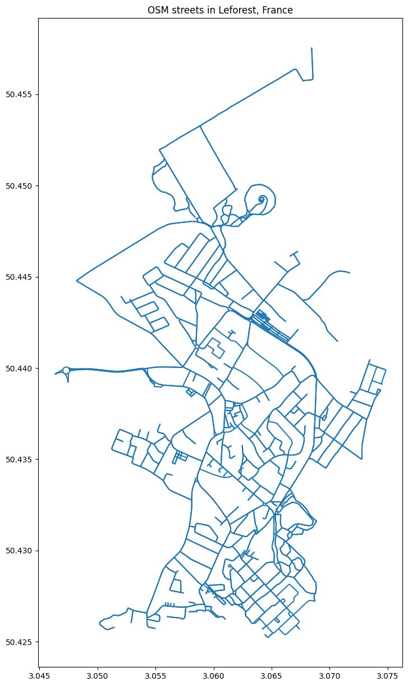

# POC: OSM ingestion to postGIS database

## 1. PostGIS setup

```bash
# 1. Start and enable PostgreSQL service
sudo systemctl start postgresql
sudo systemctl enable postgresql

# Install the PostGIS extension
sudo apt-get update
sudo apt-get install postgis postgresql-14-postgis-3
sudo systemctl restart postgresql

# 2. Access the PostgreSQL prompt as the default postgres user
sudo -u postgres psql

# 3. Inside the PostgreSQL prompt, run the following SQL commands:

# Create a new database
CREATE DATABASE osm_database;

# Create a new user with a password
CREATE USER yzpt WITH PASSWORD 'pwd';

# Grant the user privileges on the database
GRANT ALL PRIVILEGES ON DATABASE osm_database TO yzpt;

# Connect to the new database
\c osm_database;

# Enable the PostGIS extension
CREATE EXTENSION postgis;

# Exit PostgreSQL prompt
\q
```

## 2. Python process

### 2.1. import modules


```python
import pandas as pd
import geopandas as pd
import osmnx as ox
import geopandas as gpd
from sqlalchemy import create_engine

```

### 2.2. Create connection to the database


```python
# Define town name and database connection parameters
town_name = "Leforest, France"  # Specify the desired town
db_name = "osm_database"
db_user = "yzpt"
db_password = "pwd"
db_host = "localhost"  # Or the host IP if it's remote
db_port = "5432"       # Default PostgreSQL port

# Set up the database connection using SQLAlchemy
engine = create_engine(f"postgresql+psycopg2://{db_user}:{db_password}@{db_host}:{db_port}/{db_name}")

```

### 2.3. OSM data download for the town (Leforest, France, in this case) and postGIS ingestion


```python
# Download the street network data for the specified town
G = ox.graph_from_place(town_name, network_type="all")

# Convert the network graph to a GeoDataFrame (edges only)
edges = ox.graph_to_gdfs(G, nodes=False)

# Save the GeoDataFrame to a file
# edges.to_file("edges.shp")

# Save the street layer (edges) into the PostgreSQL database as a table named "osm_streets"
edges.to_postgis("osm_streets_leforest", con=engine, if_exists="replace", index=False)
print("OSM streets data successfully saved to PostgreSQL!")
```

### 2.4. Query the OSM data from the database


```python
query = "SELECT * FROM osm_streets_leforest;" 
gdf = gpd.read_postgis(query, engine, geom_col='geometry')
```


```python
gdf.head()
```


<div>
<style scoped>
    .dataframe tbody tr th:only-of-type {
        vertical-align: middle;
    }

    .dataframe tbody tr th {
        vertical-align: top;
    }

    .dataframe thead th {
        text-align: right;
    }
</style>
<table border="1" class="dataframe">
  <thead>
    <tr style="text-align: right;">
      <th></th>
      <th>osmid</th>
      <th>name</th>
      <th>highway</th>
      <th>oneway</th>
      <th>reversed</th>
      <th>length</th>
      <th>geometry</th>
      <th>junction</th>
      <th>ref</th>
      <th>maxspeed</th>
      <th>access</th>
      <th>service</th>
      <th>lanes</th>
      <th>width</th>
      <th>tunnel</th>
    </tr>
  </thead>
  <tbody>
    <tr>
      <th>0</th>
      <td>107901967</td>
      <td>Rue de Dury</td>
      <td>residential</td>
      <td>False</td>
      <td>True</td>
      <td>202.152</td>
      <td>LINESTRING (3.05885 50.44392, 3.06047 50.44344...</td>
      <td>None</td>
      <td>None</td>
      <td>None</td>
      <td>None</td>
      <td>None</td>
      <td>None</td>
      <td>None</td>
      <td>None</td>
    </tr>
    <tr>
      <th>1</th>
      <td>107916385</td>
      <td>Rue d'Amiens</td>
      <td>residential</td>
      <td>False</td>
      <td>True</td>
      <td>53.273</td>
      <td>LINESTRING (3.05885 50.44392, 3.05882 50.44388...</td>
      <td>None</td>
      <td>None</td>
      <td>None</td>
      <td>None</td>
      <td>None</td>
      <td>None</td>
      <td>None</td>
      <td>None</td>
    </tr>
    <tr>
      <th>2</th>
      <td>1009079423</td>
      <td>Rue d'Amiens</td>
      <td>residential</td>
      <td>False</td>
      <td>False</td>
      <td>64.675</td>
      <td>LINESTRING (3.05885 50.44392, 3.05894 50.44404...</td>
      <td>None</td>
      <td>None</td>
      <td>None</td>
      <td>None</td>
      <td>None</td>
      <td>None</td>
      <td>None</td>
      <td>None</td>
    </tr>
    <tr>
      <th>3</th>
      <td>107901971</td>
      <td>Résidence Domaine du Bois</td>
      <td>residential</td>
      <td>False</td>
      <td>True</td>
      <td>95.189</td>
      <td>LINESTRING (3.06241 50.44377, 3.06345 50.44431)</td>
      <td>None</td>
      <td>None</td>
      <td>None</td>
      <td>None</td>
      <td>None</td>
      <td>None</td>
      <td>None</td>
      <td>None</td>
    </tr>
    <tr>
      <th>4</th>
      <td>107901973</td>
      <td>None</td>
      <td>residential</td>
      <td>True</td>
      <td>False</td>
      <td>8.168</td>
      <td>LINESTRING (3.05873 50.44114, 3.05874 50.44116...</td>
      <td>roundabout</td>
      <td>None</td>
      <td>None</td>
      <td>None</td>
      <td>None</td>
      <td>None</td>
      <td>None</td>
      <td>None</td>
    </tr>
  </tbody>
</table>
</div>


### 2.5. Quick visualization of the street network


```python
import matplotlib.pyplot as plt

# Plot the GeoDataFrame
ax = gdf.plot(figsize=(15, 15))

# Set the title
ax.set_title("OSM streets in Leforest, France")

# Show the plot
plt.show()
```


    

    

